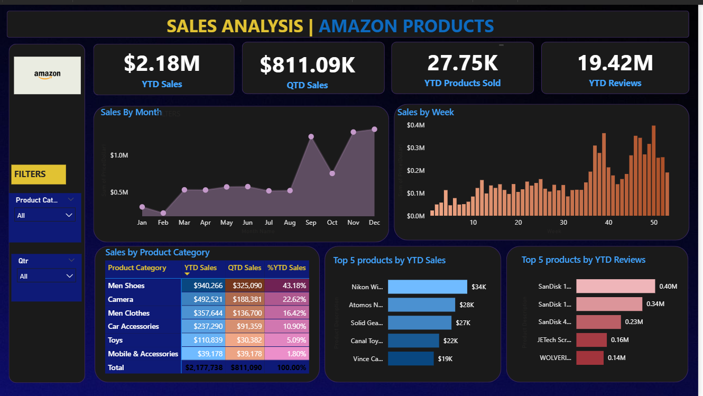

# 📊 Amazon Sales Analysis – Power BI Project

This Power BI project provides an analytical overview of Amazon product sales, focusing on key performance indicators (KPIs), product category insights, and customer engagement through reviews. The dashboard delivers interactive visualizations for business stakeholders to make informed decisions.

---

## 🧩 Problem Statement

The goal of this project is to analyze Amazon sales data to extract insights on performance, customer behavior, and product trends. The key business questions addressed include:

- How are sales trending year-to-date (YTD) and quarter-to-date (QTD)?
- What are the most sold products and categories?
- Which products receive the most reviews and customer engagement?
- How does performance vary across time (monthly/weekly)?

---

## 📌 KPIs Tracked

- **YTD Sales** – Total sales revenue year-to-date.
- **QTD Sales** – Total sales revenue for the current quarter.
- **YTD Products Sold** – Total quantity of products sold year-to-date.
- **YTD Reviews** – Total number of customer reviews year-to-date.

---

## 📊 Visualizations

| Visualization                     | Type           | Purpose                                                                 |
|----------------------------------|----------------|-------------------------------------------------------------------------|
| Sales by Month                   | Line Chart     | Shows sales trends over time (monthly).                                |
| Sales by Week                    | Column Chart   | Highlights weekly fluctuations in sales.                               |
| Sales by Product Category        | Table/Heatmap  | Gives a high-level view of category-wise performance.                  |
| Top 5 Products by YTD Sales      | Bar Chart      | Identifies top revenue-generating products.                            |
| Top 5 Products by YTD Reviews    | Bar Chart      | Shows most-reviewed products to understand customer engagement.        |

---

## 🔧 Features & Tools Used

- **Power BI Desktop**
- **CSV file connection**
- **Power Query** for data cleaning and shaping
- **Data Modeling** with relationships and calculated columns
- **DAX Functions**:
  - `CALCULATE`
  - `YTD`, `QTD`
  - Date, Filter, and Text functions
- **Time Intelligence**: Custom calendar table
- **Custom Sorting & Formatting**
- **Interactive Filters**: Product Category, Quarter
- **Navigation and Layout Optimization**

---

